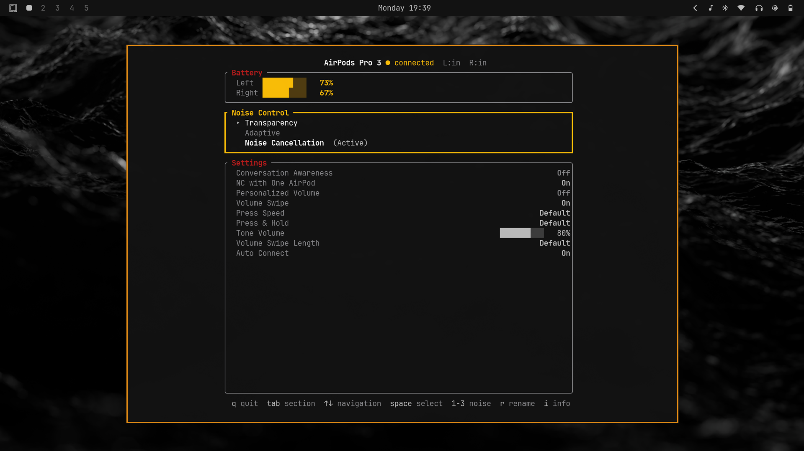

# airpods-tui

A terminal UI for managing AirPods on Linux, built for [Omarchy](https://omarchy.org/). Controls noise mode, conversation awareness, stem settings, and more over Bluetooth AACP.



## Features

- Battery status (Left, Right, Case)
- Noise control (Transparency, Adaptive, Noise Cancellation)
- Settings: Conversation Awareness, One-Bud ANC, Personalized Volume, Volume Swipe, Press Speed, Tone Volume, and more
- Stem press media controls (play/pause, next/prev track)
- Device renaming
- Volume swipe synced to system volume via configurable commands
- Waybar JSON output (`--waybar` / `--waybar-watch`)
- Supports 26 Apple/Beats models with per-model capability detection

## Usage

```
airpods-tui              # launch TUI
airpods-tui --waybar     # print JSON status and exit
airpods-tui --waybar-watch  # persistent JSON output on changes
airpods-tui -d           # enable debug logging (/tmp/airpods-tui.log)
```

## Keys

| Key | Action |
|-----|--------|
| `q` / `Ctrl+C` | Quit |
| `Tab` / `Shift+Tab` | Cycle section |
| `Up` / `Down` | Navigate rows |
| `Left` / `Right` | Adjust slider/enum; switch device tab |
| `Space` / `Enter` | Toggle / select |
| `1-3` | Noise mode shortcut |
| `c` | Toggle Conversation Awareness |
| `r` | Rename device |

## Configuration

Optional config at `~/.config/airpods-tui/config.toml`:

```toml
volume_osd_command = ["swayosd-client", "--output-volume", "{}"]
volume_set_command = ["wpctl", "set-volume", "@DEFAULT_AUDIO_SINK@", "{}"]
# restart_audio_server = ["systemctl", "--user", "restart", "wireplumber"]
```

## Dependencies

- BlueZ (D-Bus)
- PipeWire + WirePlumber (`wpctl`)
- SwayOSD (volume overlay, configurable)

## Building

```
cargo build --release
```

## License

GPL-3.0-or-later
