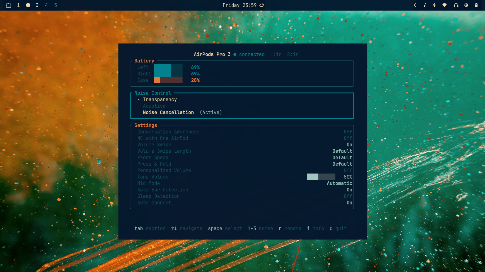

# airpods-tui

A terminal UI for managing AirPods on Linux, built for [Omarchy](https://omarchy.org/). Controls noise mode, conversation awareness, stem settings, and more over Bluetooth AACP.



## Features

- Battery status with color indicators and low-battery alerts
- Noise control (Transparency, Adaptive, Noise Cancellation)
- Settings: Conversation Awareness, One-Bud ANC, Personalized Volume, Volume Swipe, Press Speed, Tone Volume, and more
- Ear detection status in header
- Stem press media controls (play/pause, next/prev track)
- Device renaming
- Volume swipe synced to system volume via configurable commands
- Auto audio rerouting to AirPods on connect
- Waybar JSON output (`--waybar` / `--waybar-watch`)
- Background daemon with IPC for seamless reconnection
- Supports 26 Apple/Beats models with per-model capability detection

## Install on Omarchy

### 1. Install

From the AUR:

```bash
yay -S airpods-tui-git
```

Or build from source:

```bash
git clone https://github.com/annoyedmilk/airpods-tui.git
cd airpods-tui
cargo build --release
sudo cp target/release/airpods-tui /usr/bin/airpods-tui
```

### 2. Enable the background daemon

This keeps the daemon running so the TUI can connect instantly via IPC:

```bash
cp airpods-tui.service ~/.config/systemd/user/
systemctl --user daemon-reload
systemctl --user enable --now airpods-tui.service
```

### 3. Add Waybar module

Add this to `~/.config/waybar/config.jsonc` inside the modules list:

```jsonc
"custom/airpods": {
    "exec": "airpods-tui --waybar-watch",
    "return-type": "json",
    "format": "󰎈 {}",
    "on-click": "omarchy-launch-airpods"
}
```

Then add `"custom/airpods"` to your bar's `modules-right` (or wherever you prefer) and restart Waybar:

```bash
omarchy-restart-waybar
```

### 4. Pair your AirPods

Open the AirPods case, hold the button on the back until the light flashes white, then pair via Bluetooth settings or `bluetoothctl`.

## Usage

```
airpods-tui                 # launch TUI
airpods-tui --daemon        # run as background daemon (no TUI)
airpods-tui --waybar        # print JSON status and exit
airpods-tui --waybar-watch  # persistent JSON output on changes
airpods-tui -d              # enable debug logging ($XDG_RUNTIME_DIR/airpods-tui.log)
airpods-tui -v              # show version and exit
```

## Keys

| Key | Action |
|-----|--------|
| `q` / `Ctrl+C` | Quit |
| `Tab` / `Shift+Tab` | Cycle section |
| `Up` / `Down` | Navigate rows |
| `Left` / `Right` | Adjust slider/enum; switch device tab |
| `Space` / `Enter` | Toggle / select |
| `1-3` | Noise mode shortcut |
| `c` | Toggle Conversation Awareness |
| `r` | Rename device |
| `i` | Device info (model, firmware, serial) |

## Configuration

Optional config at `~/.config/airpods-tui/config.toml`:

```toml
volume_osd_command = ["swayosd-client", "--output-volume", "{}"]
volume_set_command = ["wpctl", "set-volume", "@DEFAULT_AUDIO_SINK@", "{}"]
battery_alert_command = ["notify-send", "AirPods", "{}"]
# restart_audio_server = ["systemctl", "--user", "restart", "wireplumber"]
```

## Dependencies

- BlueZ (D-Bus)
- PipeWire + WirePlumber (`wpctl`)
- SwayOSD (volume overlay, configurable)

## Building

```
cargo build --release
```

## License

GPL-3.0-or-later
